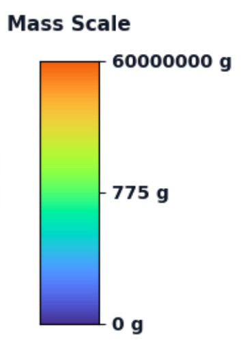

<div align="center" style="
  background: linear-gradient(90deg, #440154, #31688e, #35b779, #fde725);
  padding: 18px;
  border-radius: 14px;
  color: #ffffff;
  font-family: system-ui, -apple-system, BlinkMacSystemFont, 'Segoe UI', sans-serif;
  margin-bottom: 26px;
">
  <h1 style="margin: 0; font-size: 1.9rem;">
    INFO 511 — Foundations of Data Science — Fall 2025
  </h1>
</div>

<div style="
  display: flex;
  justify-content: space-between;
  align-items: flex-start;
  gap: 18px;
  margin-bottom: 32px;
">
  <!-- Left image -->
  <div style="width: 48%; text-align: left;">
    
  </div>

  <!-- Right panel: GIF + mass scale -->
  <div style="width: 48%;">
    <div style="
      display: flex;
      align-items: center;
      gap: 10px;
    ">
      

      
    </div>

    <div style="
      margin-top: 10px;
      padding: 10px 12px;
      border: 2px solid #31688e;
      border-radius: 10px;
      font-size: 0.95rem;
      color: #000000;
      background: #ffffff;
      font-family: system-ui, -apple-system, BlinkMacSystemFont, 'Segoe UI', sans-serif;
      text-align: center;
    ">
      Meteorite “Found/Fell” data from 1800–2013; color scale corresponds to meteorite mass.
    </div>
  </div>
</div>

---

## 📁 Repository Structure

```text
INFO_511_FA_25_Final_Proj_Repo/
├── _code/        # Analysis scripts, models, and utilities
├── _media/       # Images, figures, animations, and legends
├── _report/      # Written report, appendices, and supporting material
├── LICENSE
└── README.md
